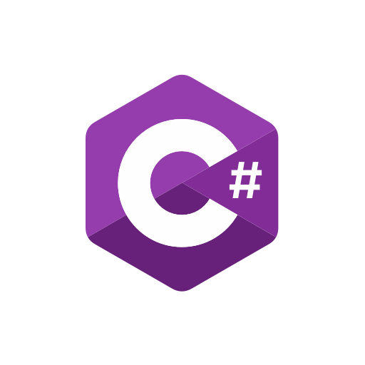
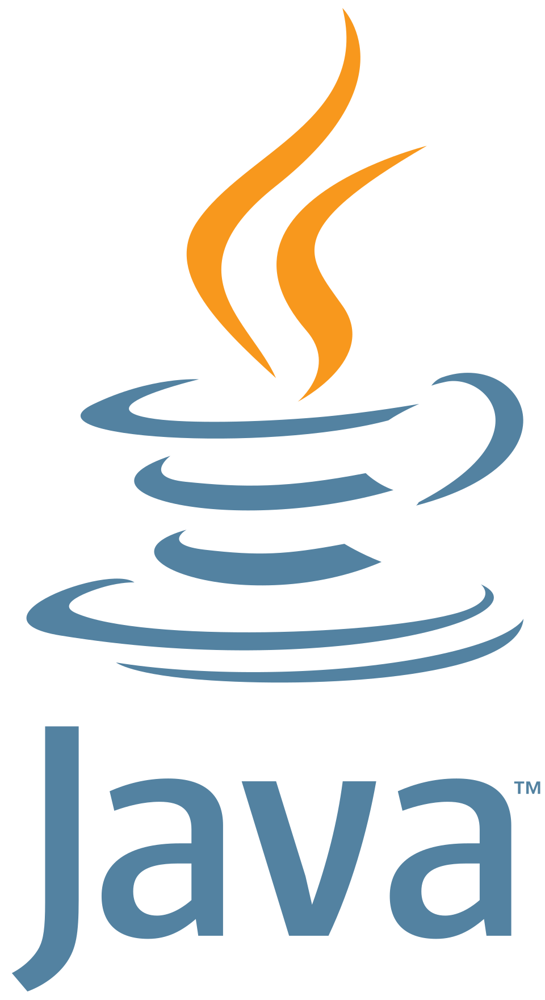
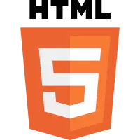
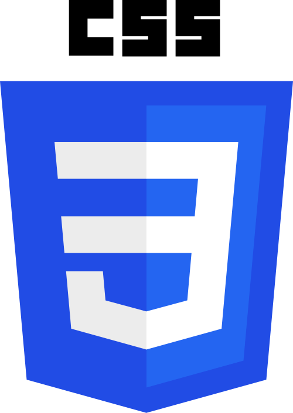

## **Languages Used (For Backend)**
- C# 
- NodeJS  
- Java 

## **Languages Used (For Frontend)**
- Javascript
- Html 
- Css 

## **IDEs**
- Visual Studio Code 
- Visual Studio 
- Eclipse 
- Intellij Idea 